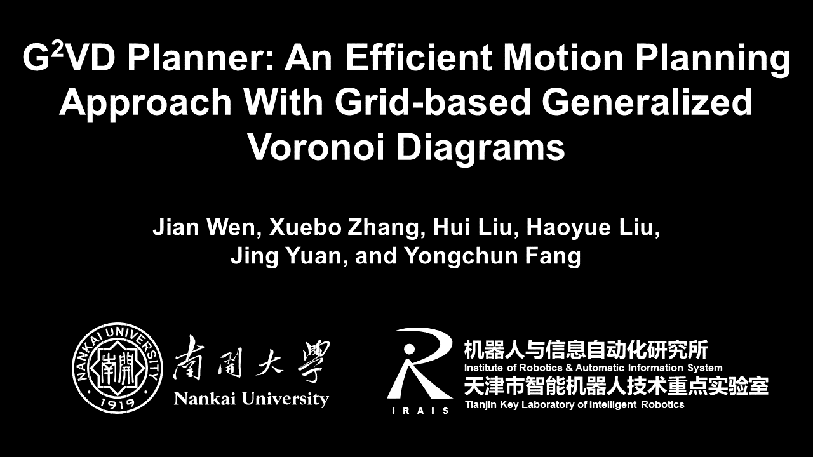

# G2VD Planner

G2VD planner is an efficient motion planning approach with grid-based generalized Voronoi diagrams. It has been applied to mobile robot navigation in indoor and outdoor environments. 

The following video shows autonomous navigation in a large-scale campus with unknown static and dynamic obstacles.
<a href="https://youtu.be/V-S8cS2zv_U" target="_blank">

</a>

The paper about G2VD planner is summitted to IEEE RA-L with 2022 IEEE/RSJ IROS (under review). We wiil release the implementation of G2VD planner once the paper is accepted.

## License
The source code will be released under BSD 3-Clause license.