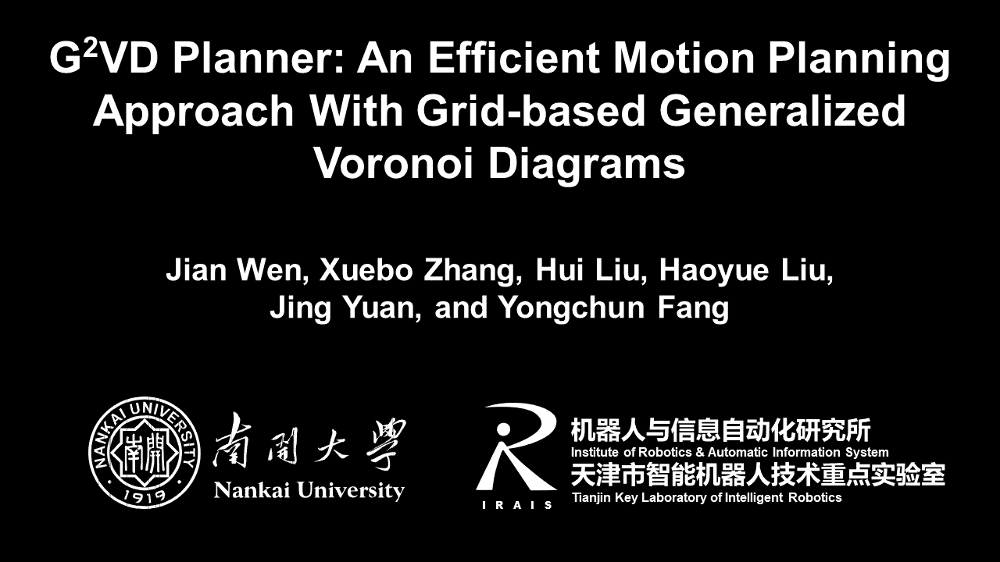

# G2VD Planner

G2VD planner is an efficient motion planning approach with grid-based generalized Voronoi diagrams. It has been applied to mobile robot navigation in both indoor and outdoor environments. 

The following video shows autonomous navigation on a large-scale campus with unknown static and dynamic obstacles.

The preprint is available at [arXiv](https://arxiv.org/abs/2201.12981). We will release the implementation of G2VD planner once the paper is accepted.

## License
The source code will be released under BSD 3-Clause license.
